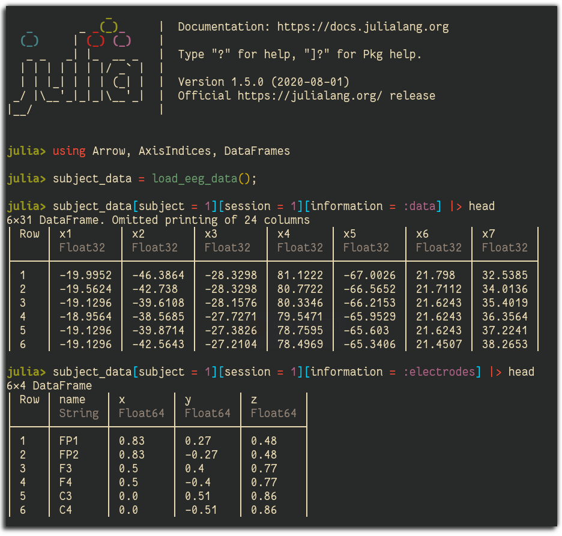

# NeuriViz

> An experiment in making multimodal visualization schemes to investigate effective brain connectivity.

Authors: Jacob Zelko, Zachary P Christensen



This is a Work-in-Progress exploration of making easy visualizations to enable rapid interactivity and feedback with EEG data. 

To (locally) reproduce this project, do the following:

0. Download this code base. Notice that raw data are typically not included in the
   git-history and may need to be downloaded independently.
1. Open a Julia console and do:
   ```
   julia> using Pkg
   julia> Pkg.activate("path/to/this/project")
   julia> Pkg.instantiate()
   ```

This will install all necessary packages for you to be able to run the scripts and
everything should work out of the box.
